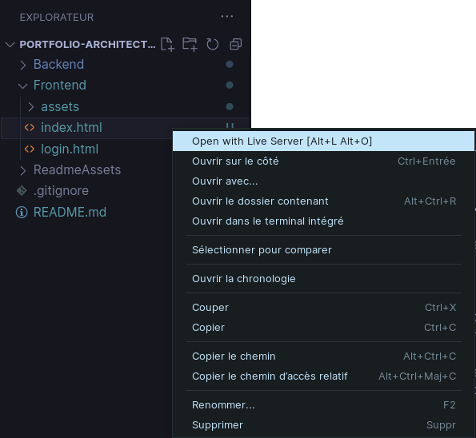

# Portfolio de Sophie Bluel

## You have never done dynamic webpages?

I didn't either...  
This is my first dynamic website (using Javascript).

Project made during an _OpenClassrooms_ bootcamp.  
[Learning path: _Développeur Web_](https://openclassrooms.com/fr/paths/717-developpeur-web)

No JS library allowed.

## How to run this project

### Staticly

**This project's codebase is designed to be (as most as possible) runned as a static website.**  
To launch the backend of this project, look at [this README](./Backend/ReadMe.md).

To launch the frontend of this project, you can simply open [index.html](./Frontend/index.html).  

> ℹ️ **However, it could be unsafe because of the _LocalStorage_ handling of your browser.**  
> (Nowadays, it works on Chromium based browsers, but not on Firefox ones.)

### On a local server

**The safer way to run it is to open this project folder in VSCode and then open [index.html](./Frontend/index.html) in a [LiveServer instance](https://marketplace.visualstudio.com/items?itemName=ritwickdey.LiveServer).**

<p align="center"><br><b>⚠️ CAUTION: MAKE SURE YOUR FILETREE LOOKS LIKE ON THIS SCREENSHOT</b></p>

> ℹ️ You should also disable the Live Server Hot Reload feature to avoid triggering it when the SQL Lite file is modified.

**Just edit your `liveServer.settings.ignoreFiles` VSCode setting like this:**
```json
"liveServer.settings.ignoreFiles": [
    "**"
]
```

**You're ready to go!** 🚀

---

### Resources

- [Figma Mockups](www.figma.com/file/kfKHknHySoTibZfdolGAX6/Desktop)

---

<p align="center"><em>This GitHub repository is not part of the OPENCLASSROOMS website or OPENCLASSROOMS SAS.<br>Additionally, this GitHub repository is NOT endorsed by OPENCLASSROOMS in any way.<br>OPENCLASSROOMS is a trademark of OPENCLASSROOMS, SAS.</em></p>